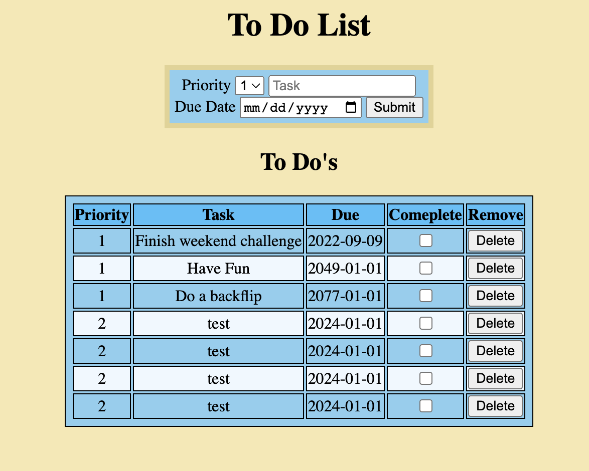
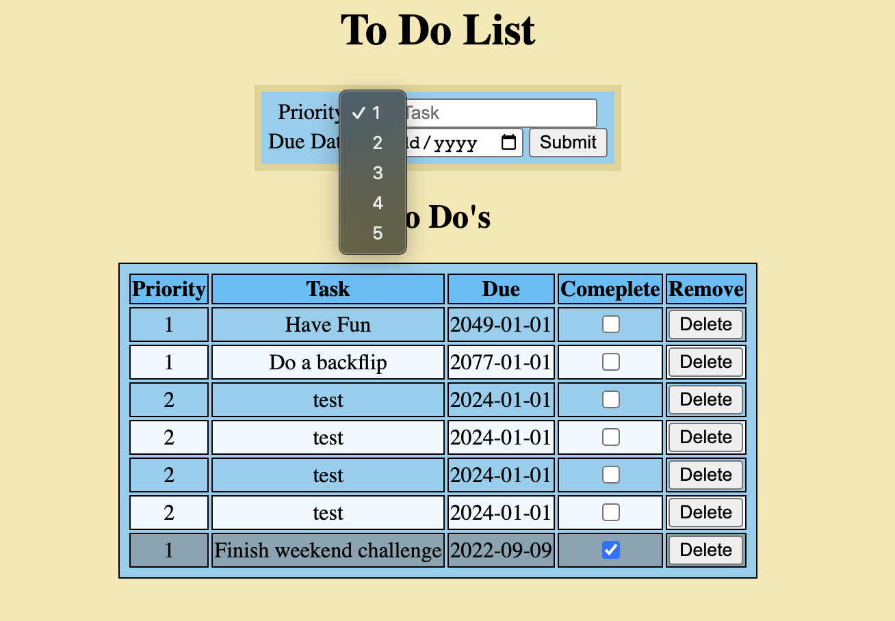

# To Do List

## Description

_Duration: 2 Day Sprint_

This application mimics a very basic to do list. It allows for the user to set the priority and due date of their to-do and allows the user to check off completed tasks.

---

---

---

---

---

---

## Prerequisites

-[node js](https://nodejs.org/en/)

-[NPM](https://docs.npmjs.com/)

-[express js](https://expressjs.com/)

-[postregres](https://node-postgres.com/)

## Usage
1. User can type in a task they wish to completed in the task input box.
2. Optional: User may set a priority level and due date.
    - priority defaults to 1.
3. Once inputs have been filled the user may click the submit button to add the to-do to the list.
4. On the list the user can check a box to complete a task.
5. The delete buttons on the rows of the list will delete that task.

## Acknowledgement
Thanks to [Emerging Digital Academy](https://emergingacademy.org/) for supplying me with the resources to complete this project.

## Support
If you have any questions, suggestions, or issues, please email me at [david.wesley.lindberg@gmail.com](www.google.com)